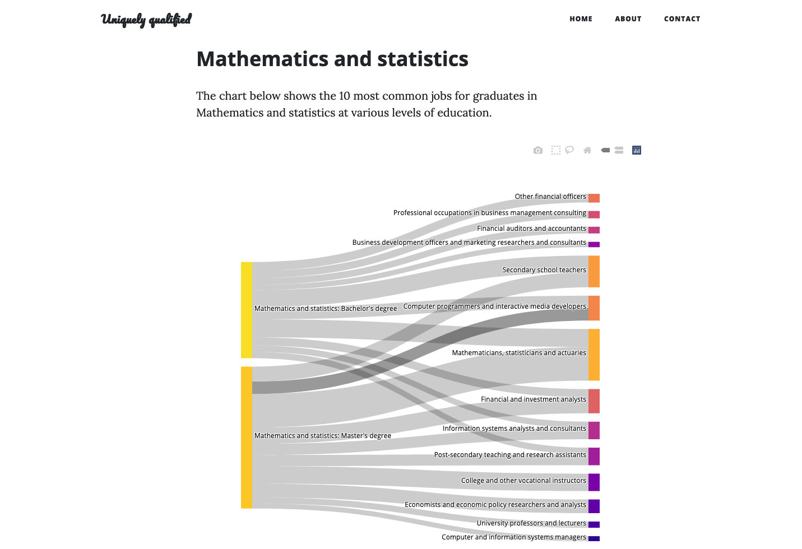
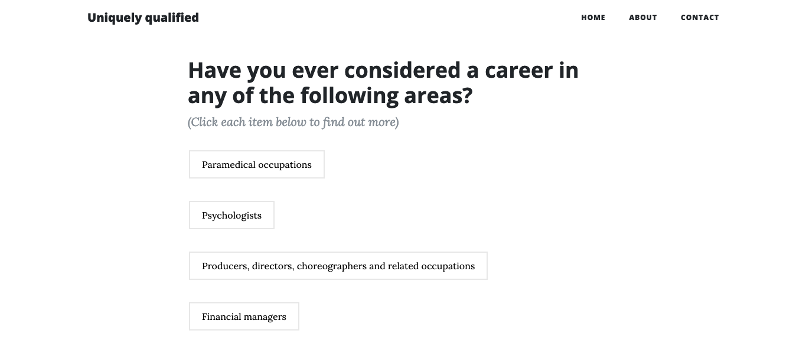
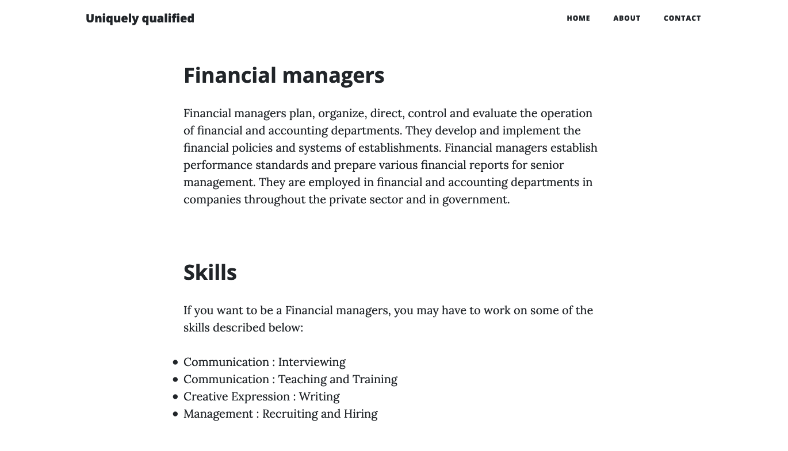

# Uniquely Qualified

## Uncommon career paths for uncommon people

</img>

Website: http://uniquely-qualified.live

### Introduction:

Uniquely qualified is an app for career discovery. The app is designed to be used by students who have recently graduated or are nearing graduation, in order to explore career paths outside of those common for their degree. The app uses data from the National Graduate Survey to chart common and uncommon paths for users. To suggest uncommon paths, the app makes use of NLP and topic modeling to derive topics shared by the common career paths and an optional chosen hobby.

The idea for integrating hobbies/interests into consideration for career paths comes from the idea of making yourself a double- or triple-threat by simply being above average in a number of different areas. This idea is decribed by the creator of the *Dilbert* comic strip in the quote below.

> If you want an average successful life, it doesn’t take much planning. Just stay out of trouble, go to school, and apply for jobs you might like. But if you want something extraordinary, you have two paths:\
1. Become the best at one specific thing.\
2. Become very good (top 25%) at two or more things.
>
> The first strategy is difficult to the point of near impossibility. Few people will ever play in the NBA or make a platinum album. I don’t recommend anyone even try.
>
> The second strategy is fairly easy. Everyone has at least a few areas in which they could be in the top 25% with some effort. In my case, I can draw better than most people, but I’m hardly an artist. And I’m not any funnier than the average standup comedian who never makes it big, but I’m funnier than most people. The magic is that few people can draw well and write jokes. It’s the combination of the two that makes what I do so rare. And when you add in my business background, suddenly I had a topic that few cartoonists could hope to understand without living it.
>
> …Get a degree in business on top of your engineering degree, law degree, medical degree, science degree, or whatever. Suddenly you’re in charge, or maybe you’re starting your own company using your combined knowledge. Capitalism rewards things that are both rare and valuable. You make yourself rare by combining two or more “pretty goods” until no one else has your mix…
>
> It sounds like generic advice, but you’d be hard pressed to find any successful person who didn’t have about three skills in the top 25%.
>
> *- Scott Adams, creator of the Dilbert comics*

Following this advice, graduates may want to integrate skills from hobbies or side projects into their job search to expand their possible options.

### Setup and installation:

After cloning this repository, run the following code:

`cd career-app/career-build
pip install -r requirements.txt`

App can then be run locally using:

`cd ..
python run.py`

### Usage

Enter your degree on the homepage to get a visualization of the most common jobs for your stated degree. You are also given the option of entering a hobby, which may indicate additional skills or interests to guide the presentation of uncommon career paths.

</img>

The app will also load recommendations for uncommon jobs you may want to consider.

</img>

Clicking on one of these 'uncommon' jobs will take you to a description of the job with a list of skills you may be missing given your educational background.

</img>
